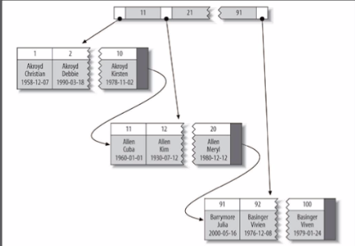
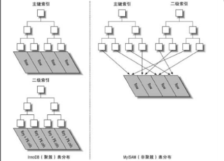
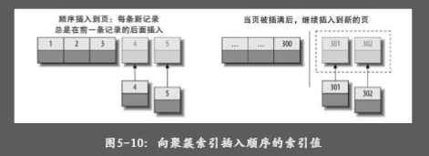
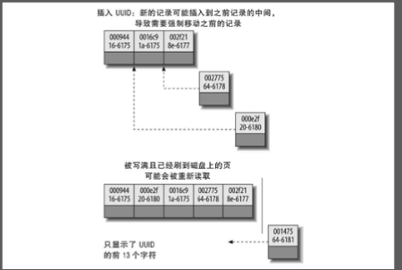

# 并发控制
## 读写锁
在处理并发读或者写时，可以通过实现一个由两种类型的锁组成的锁系统来解决问题。这两种类型的锁通常被称为共享锁`(shared lock)`和排他锁`(exclusive lock)`，也叫做读锁`(read lock)`和写锁`(write lock)`

- 读锁
  共享的，互相不阻塞的。多个客户在同一时刻可以同时读取同一个资源，而互不干扰。
- 写锁
  写锁是排他的，也就是说一个写锁会阻塞其他的写锁和读锁。

这是出于安全的考虑吧，只有这样，才能确保在给定的时间里，只有一个用户能执行写入，并防止其他用户读取正在写入的同一资源。

## 锁粒度
一种提高共享资源并发性的方式就是让锁定对象更有选择性。任何时候在给定的资源上，锁定的数据量越少则系统的并发程序越高，只要互相之间不发生冲突即可。

加锁也需要消耗资源。锁的各种操作，包括获得锁，检查锁是否已经解除，释放锁等，读会增加系统的开销

最重要的两种锁策略
- 表锁(table lock)
  是mysql中最基本的锁策略，并且是开销最小的策略。  
  用户在对表进行写操作时(增删改)前，需要现货的写锁，这回阻塞其他用户对该表的所有读写操作。只有没有写锁时，其他读取的用户才能获得读锁，读锁之间是不相互阻塞的    
  MyISAM InnoDB引擎都实现了标记锁
- 行级锁(row lock)
  行级锁可以最大程度的支持并发处理(同时也带来了最大的锁开销)
  InnoDB实现了行级锁，默认情况是采用行级锁
  
## 事务

- 原子性(atomicity)  
  一个事务必须被视为一个不可分割的最小工作单元，整个事务中的所有操作要么全部提交成功，要么全部失败回滚，对于一个事务来说，不可能只执行其中一部分操作，这就是事务的原子性
- 一致性(consistency)
  数据库总是从一个一致性的状态转换到另一个一致性的状态。
- 隔离性(isolation)
  一个事务所做的修改在最终提交以前，对其他的事务是不可见的
- 持久性(durability)
  一旦事务提交，其所做的修改就会永久保存到数据库中。

### 隔离级别
在SQL标准中定义了四种隔离级别，每一种级别都规定了一个事务中所做的修改，哪些在事务内和事务间是可见的，哪些是不可见的。较低级别的隔离通常可以执行更高的并发，系统的开销也更低。

- READ UNCOMMITTED(未提交读)  
  事务中的修改，即使没有提交，对其他事务也都是可见的。事务可以读取未提交的数据，这也被称为脏读(Dirty Read)   
  脏读 指当一个事务正在访问数据，并对数据进行了修改，而这种修改还没有提交到数据库，这时，另外一个事务也访问这个数据，然后使用了这个数据, 但是最后又撤销了对数据的更改
- READ COMMITTED(提交读)  
  一个事务从开始直到提交之前，所做的任何修改对其他事务都是不可见的。这个级别也叫做不可重复读，因为两次执行同样的查询，可能会得到一样的结果  
  不可重复读 指在一个事务内，多次读取同一数据。在这个事务还没有结束时，另一个事务也访问了该同一数据，那么，在第一个事务中的两次读数据之间，由于第二次事务的修改，那么一个事务两次读取的数据可能是不一样的，这样就发生了在一个事务内两次读到的数据是不一样的。
- REPEATABLE READ(可重复读)
  解决了脏读的问题，该级别保证了在同一个事务中多次读取同样的记录的结果是一致的。但是又产生的另一个问题幻读(Phantom Read)  
  幻读 指当某个事务在读物某个范围内的记录时，另外一个事务又在该范围内插入了新的记录，当之前的事务再次读取该范围的记录时，就会产生幻读(Phantom Read)
- SERIALIZABLE(可串行化)
  是最高的隔离级别，它强制事务串行执行，避免了前面说的幻读的问题。简单来说SERIALIZABLE会在读取的每一行数据上都加锁，所以可能导致大量的超时和所争用的问题


### 死锁
死锁是指两个或者多个事务在同一资源上相互占用，并请求锁定对方占用的资源，从而导致恶性苏循环的现象。但多个事务试图以不同的顺序占用锁资源时，就会产生死锁。多个事务同时锁定同一个资源时也会产生死锁。  
InnoDB存储引擎，可以检测到死锁的循环依赖，并立即返回一个错误。

### MySQL中的事务
mysql提供了两种事务型的存储引擎：`InnoDB`和`NDBCluster`
Mysql服务层不管理事务 事务是底层存储引擎管理的
```sql
START TRANSACTION | BEGIN [WORK]  开始
COMMIT [WORK] [AND [NO] CHAIN] [[NO] RELEASE]  提交
ROLLBACK [WORK] [AND [NO] CHAIN] [[NO] RELEASE]  回滚
SET AUTOCOMMIT = {0 | 1}    开启自动提交
``` 
默认的隔离级别是REPEATABLE READ，并且在此隔离级别更进一步，通过多版本并发控制(MVCC)解决不可重复读，加上间隙锁解决幻读。因此InnoDB的RR隔离级别其实实现了串行化的效果。事务的隔离性是通过锁实现，而事务的原子性、一致性、持久性是通过事务日志实现。redo和undo  
- redo log 重做日志 
  在InnoDB的存储引擎中，事务日志通过重做日志和innoDB存储引擎的日志缓冲实现。事务开启时，事务中的操作，都会先写入存储引擎的日志缓冲中。事务开启时，事务中的操作，都会写入存储引擎的日志缓中，这些缓冲的日志都需要提前刷新到磁盘上持久化  
  
- undo log 回滚日志


#### 自动提交(AUTOCOMMIT)
默认采用自动提交模式。
```sql
SHOW VARIABLES LIKE "AUTCOMMIT"
SET AUTOCOMMIT = 1; 开启自动提交
```
#### 隐式和显式锁定 
- 隐式锁定 
InnoDB采用的是两阶段锁定协议(two-phase locking protocol)。在事务执行过程中，随时都可以执行锁定，锁只有在执行COMMIT或者ROLLBACK的时候才会释放，并且所有的锁是在同一时刻被释放。 前面描述的锁定都是隐式锁定，InnoDB都是隐式锁定，InnoDB会根据隔离级别在需要的时候自动加锁。
- 显式锁定
```sql
select ... lock in share mode //共享锁 在查询语句后面增加LOCK IN SHARE MODE，Mysql会对查询结果中的每行都加共享锁，当没有其他线程对查询结果集中的任何一行使用排他锁时，可以成功申请共享锁，否则会被阻塞
select ... for update //排他锁 排他锁又称写锁，如果事务T对数据A加上排他锁后，则其他事务不能再对A加任任何类型的封锁。获准排他锁的事务既能读数据，又能修改数据。
```
## 多版本并发控制
可以认为MVCC是行级锁的一个变种，但是他在很多情况下避免了加锁操作，因为开销更低。  
MVCC的实现是通过保存数据在某个时间点的跨着来实现的，

### InnoDB中的MVCC
是通过在每行记录后面保存两个隐藏的列来实现的。保存了行的创建时间和过期时间，但存储的不是实际的时间值，而是系统版本号(system version number)。每开始一个新的事务，系统版本都会自动递增。“事务开始时刻的系统版本号会作为事务的版本号，用来和查询到的每行记录的版本号进行比较”

具体的实现
- SELECT
  InnoDB会根据以下两个条件检查每行记录
  - InnoDB只查找版本早于当前事务的数据行，这样就可以确保事务读取的行，要么是在事务开始前已经存在的，要么是事务自身插入或者修改过的
  - 行的删除版本要么未定义，要么大于当前事务版本号。这可以确保事务读取到的行，在事务开始之前未被删除
- INSERT
  InnoDB为新插入的每一行保存当前系统版本号作为版本号
- DELETE
  InnoDB为删除的每一行保存当前系统版本号作为行删除标识
- UPDATE
  InnoDB为插入一行记录，保留当前系统版本号作为行版本号，同时保存当前保本好导员来的行作为删除标识

`MVCC`只在`可重复读(REPEATABLE READ)`和`读已提交(READ COMMITED)`两个隔离级别下工作

## 存储引擎

### InnoDB存储引擎
InnoDB的数据存储在表空间，表空间是由InnoDB管理的一个黑盒子，由一系列的数据文件组成。  
行锁 所以写入效率高
采用`MVCC`来支持高并发，并且实现了四个标准的隔离级别。默认是REPEATABLE READ(可重复读)  
基于`聚簇索引`建立的  
支持事务，外键  

### MyISAM存储引擎
将表存储在两个文件中，数据文件和索引文件，所以查询效率较高 
- 加锁与并发
  MyISAM对整张表加锁，而不是针对行。读取时会对需要读到的所有表加共享锁，写入时对表加排他锁。
- 查询效率高
  索引


#  数据类型
如何选择正确的数据类型
- 更小的通常更好
- 简单就好
- 尽量避免使用NULL
  如果查询中包含可为NULL的列，对于MySQL来说更难优化，因为NULL的列使得索引，索引统计和之比较更加复杂。可谓NULL的列会使用更多的存储空间，在Mysql也需要特殊处理。当可为NULL的列被索引时，每个索引记录需要一个额外的字节，

VARCHAR适合的场景：字符串列的最大长度比平均长度大很多，列的更新很少，所以碎片不是问题
VARCHAR(10) 表示最长可以存储10个字节，但是需要11个字节的存储空间来存储，因为要存储长度信息
CHAR适合的场景：存储很短或者所有的值都接近同一个长度，经常变更的数据，因为定长的CHAR类型不容易产生碎片
CHAR(10)表示存储最长为10个字节，不足的自动用空格填充

# 索引

## Mysql索引的类型

### B+Tree索引
所有的值都是按顺序存储的，并且每一个叶子到跟距离相同
- 全值匹配
- 匹配最左前缀
- 匹配列前缀
- 匹配范围值
限制：
- 如果不是按照索引的最左列开始查找，则无法使用索引
- 不能跳过索引中的列
- 如果查询中有某个列的范围查询，则其右边所有列都无法使用索引优化查找
### 哈希索引
索引的结构十分紧凑，查找的速度非常快。
适合等值查询  
不支持部分索引列匹配查找，因为哈希索引是使用索引列的全部内容来计算哈希值的。  
如果存在大量的重复键值，哈希索引的效率会很低，因为存在哈希碰撞  
无法利用索引进行排序  

B+ Tree索引和Hash索引区别 
- 哈希索引的结构十分紧凑，查找速度快
- 哈希索引适合等值查询，但是不无法进行范围查询 
- 哈希索引没办法利用索引完成排序 
- 哈希索引不支持多列联合索引的最左匹配规则 
- 如果有大量重复键值得情况下，哈希索引的效率会很低，因为存在哈希碰撞问题


## 聚簇索引
聚簇索引并不是一种单独的索引类型，而是一种数据存储方式。InnoDB的聚簇索引实际上在同一个数据结构保存了B-Tree索引和数据行。当表有聚簇索引时，它的数据行实际上存放在索引的叶子页(lead page)中。聚簇表示数据行和相邻的键值紧凑地存储在一起。因为无法同时吧数据行存放在两个不同的地方，所以一个表只能有一个聚簇索引  

InnoDB通过主键聚集数据，如果没有定义主键，InnoDB会选择一个唯一的非空索引代替，如果没有这样的索引，InnoDB会隐式定义一个主键来作为聚簇索引。

聚簇索引中，叶子页包含了行的全部数据，节点页只包含了索引列。




聚集的数据的优点
- 可以把相关的数据保存在一起
- 数据访问更快。聚簇索引聚簇索引将索引和数据保存在同一个B-Tree中，因此从聚簇索引中获取数据通常比在非聚簇索引中查找更快
- 使用覆盖索引扫描的查询可以直接使用叶节点中的主键值

聚簇索引的缺点
- 聚簇数据最大地提高了IO密集型应用的性能，但如果数据全部放在内存中则访问的顺序就没那么重要了，聚簇索引也没有什么优势了
- 插入速度严重依赖插入顺序。按照主键的顺序插入是加载数据到InnoDB表速度最快的方式
- 更新聚簇索引的代价很高，因为会强制InnoDB将每个被更新的行移动到新的位置
- 基于聚簇索引的表在插入新行或者逐渐被更新导致需要移动行的时候，可能面临页分裂的问题
- 聚簇索引可能导致全表扫描变慢，尤其是行比较稀疏，或者由于页分裂导致数据存储不连续的时候
- 二级索引(非聚簇索引)可能比想象的要更大，因为在二级索引的叶子节点包含了引用行的主键列
- 二级索引访问需要两次索引查找，而不是一次
  二级索引保存的是行的主键值，这意味着通过二级索引查找行，存储引起需要找到二级索引的叶子节点获得对应的主键值，然后根据这个值去聚簇索引中查找对应的行。

B+Tree的叶子节点存储了整行数据的是主键索引，也被称为聚簇索引
查询速度快，因为叶子节点就是所需要的数据    
B+Tree的叶子节点存储了主键的值是非主键索引，也被称为非聚簇索引。
可能需要需要再次回表查询，如果查询的列存在索引中就直接返回不需要在回表查询 




### 在InnoDB中按主键插入行
在插入数据时，最好避免使用随机的聚簇索引，特别是对IO密集型的应用，从性能的角度考虑，使用UUID来作为聚簇索引则会很糟糕，它使得聚簇索引的插入变化完全随机。 

 
 

因为主键的值是顺序的，所以InnoDB把每一条记录都记录在上一天记录的后面，当达到也的最大填充因子时，下一条记录就会写入新的页中。但是对于主键是UUID，因为新行的主键值不一定比之间插入的大，所以InnoDB无法简单的总是把新行插入索引的随后，而是需要为新的行为寻找何时的位置。这回增加额外的工作，并导致数据分布不够优化


- 写入的目标页可能已经刷到磁盘上并从缓存中移除，或者是还没有被加载到缓存中，InnoDB在插入之前不得不先找到并从磁盘读取目标页到内存中。这将导致大量的随机I/O。
- 因为写入是乱序的，InnoDB不得不频繁地做页分裂操作，以便为新的行分配空间。页分裂会导致移动大量数据，一次插入最少需要修改三个页而不是一个页。
- 由于频繁的页分裂，页会变得稀疏并被不规则地填充，所以最终数据会有碎片。


## 覆盖索引
Mysql中也可以使用索引来直接获取列的数据，这样就不需要读取数据行。如果一个索引包含所有需要查询的字段的值，我们就称为覆盖索引。  
不是所有类型的索引都可以称为覆盖索引。覆盖索引必须要存储索引列的值，MySQL中只可以使用B-Tree索引左覆盖索引，  
如果一个索引的为KEY(key1,key2)，这时查询key1和key2就会使用这个索引做覆盖索引。

## 联合索引 最左前缀匹配
在创建联合索引的时候将使用最频繁的字段放在最前面  
在mysql创建联合索引时会遵循最左前缀匹配的原则，即最左优先，在检索数据时从联合索引的最右边开始匹配，因为联合索引会对第一个字段的数据进行排序，然后在第一个字段的基础上然后对后面第二个字段进行排序  

对col1，col2，col3建一个联合索引    
`KEY i_c1_c2_c3 (col1,col2,col3)`  
联合索引`i_c1_c2_c3`实际建立了(`col1`,`(col1,col2)`,`(col1,col2,col3)`)三个索引  
`SELECT * FROM test where col1="" AND col2="" AND col3=""`  
上面这个查询语句执行时会依照最左前缀匹配原则，检索时会使用(col1,col2)进行数据匹配。  
联合索引的字段可以是任意顺序的


## 创建索引
mysql 创建索引
1.添加PRIMARY KEY（主键索引）
```sql
mysql>ALTER TABLE `table_name` ADD PRIMARY KEY ( `column` )
```
2.添加UNIQUE(唯一索引)

```sql
mysql>ALTER TABLE `table_name` ADD UNIQUE (
`column`
)
mysql>CREATE UNIQUE INDEX index_name ON table_name (column_list)
```
3.添加INDEX(普通索引)

```sql
mysql>ALTER TABLE `table_name` ADD INDEX index_name ( `column` )
mysql>CREATE INDEX index_name ON table_name (column_list)
```

4.添加FULLTEXT(全文索引)

```sql
mysql>ALTER TABLE `table_name` ADD FULLTEXT ( `column`)
```

5.添加多列索引

```sql
mysql>ALTER TABLE `table_name` ADD INDEX index_name ( `column1`, `column2`, `column3` )
```

## 创建索引的一些原则
- 给一些需要查询的字段建立索引
- 尽量使用多列索引，不要为每一个列单独创建索引，这样并不能将mysql索引的效率最大化
- 选择合适的索引列顺序，依照最左前缀匹配原则，
- 将选择性最高的索引放在前面，也就是会按照这个条件搜索到的数据最少，选择性就越高。