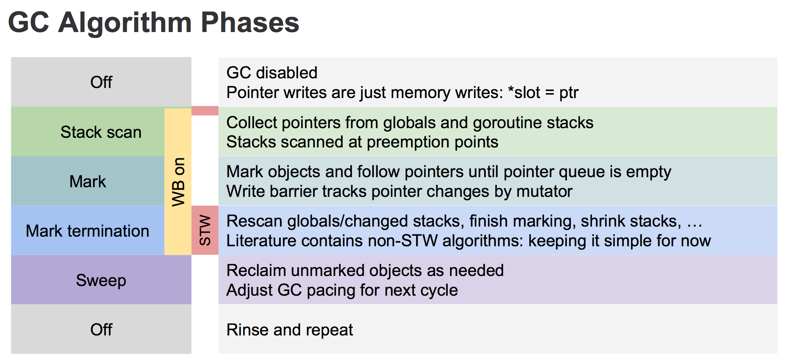

## 堆栈的概念
栈(stack) 栈是用来存储函数内部的局部变量和函数参数值，是由系统自动分配的，存储地址是连续且存在有限量可能存在栈溢出  
堆(heap) 对象内部的成员变量，局部变量，类变量，他们指向的对象都存储在堆内存中(但指针本身存在栈中)，一般速度较栈慢；存储地址通常是链式的，内存较大不会溢出

`栈`的内存是系统`自行分配回收`的，函数出栈时便会释放临时占用的内存。而`堆`内存需要我们或者`GC`来处理回收  
go局部变量的有可能在栈上分配，也有可能在堆上分配，如果`局部变量被外部引用`，那么这个变量必须在`堆`上分配。这个局部变量就是从函数中`逃逸`了。如果局部变量只在`函数内`部，没有外部的引用，那么这个局部变量就可以在`栈`上分配存储内存。  
`逃逸的变量需要额外的分配内存`

## 逃逸分析
用来确定一个变量要放在堆上还是栈上
- 是否有在其他地方被引用。只要有可能被引用了，那么它一定分配到堆上。否在分配在栈上
- 即使没有被外部引用，但对象过大，无法放在栈上，依然有可能分配到堆上

如果内存分配到堆上会出现什么问题呢
- 垃圾回收(GC)的压力不断增加，堆的内存需要GC来回收
- 申请，分配，回收内存的系统开销增大
- 动态分配产生一定的内存碎片，栈的内存是连续的

频繁申请，分配堆内存是有一定代价的。  
总体来说优化GC的一点，就是尽量的避免变量分配在堆上，这样就可以减少GC等额外的系统开销


### 逃逸分析的具体过程

- 通过编译器命令`go build --gcflags '-m -l' main.go`
  - `--gcflags`将标识参数传递给Go编译器
  - `-m`会打印出逃逸分析的优化策略
  - `-l`会禁止函数内联

- 反编译命令查看
`go tool compile -S main.go`

EG1:
```go case1.go
package main
type User struct {
	ID int64
	Name string
}


func Getuser() *User {
	return &User{ID: 1,Name: "111"}
}
func main() {
	_ = Getuser()
}
```
执行分析命令
```go
-> go build --gcflags '-m -l' case1.go 
# command-line-arguments
./case1.go:9:27: &User literal escapes to heap

```
由结果可知&User已经逃逸到了堆上

由于`Getuser`返回的是指针对象，引用被返回到了函数之外。所以编译器会把该对象分配到堆上，而不是栈上。

EG2:
```go
import "fmt"

func main() {
	str := new(string)
	*str = "LABULAKA"
	//fmt.Println(str) 
}
```
上述代码在未添加`fmt.Println(str) `的时候是未逃逸的，添加这句代码的时候发生了逃逸
```shell
# 未添加fmt时
➜  taoyi go build --gcflags '-m -l' case2.go
# command-line-arguments
./case2.go:4:12: main new(string) does not escape
# 添加fmt时
➜  taoyi go build --gcflags '-m -l' case2.go
# command-line-arguments
./case2.go:8:13: str escapes to heap
./case2.go:6:12: new(string) escapes to heap
./case2.go:8:13: main ... argument does not escape

```
因为参数为interface类型时，在编译阶段编译器无法确定其具体的类型。因此会产生逃逸，最终分配到堆上

Go 实现的`逃逸分析`可以尽可能的把生命周期短的或者作用域有限的内存对象优先分配在栈上，这样可以减少堆的分配，也就间接减轻 GC 的压力。实际开发中如果发现 GC 压力比较大，可以用性能分析工具查一下运行期间分配的堆对象是不是特别多，然后尝试分析内存逃逸优化下代码或者引入临时对象池等。

## GC算法

### 引用计数
将每个对象存储的无力空间维护一个计数器，被引用加1解除引用减1，定期清扫计数为零的对象，但无法解决循环引用，维护计数影响效能

### 标记清除
标记清楚是第一种自动内存管理，基于追踪的垃圾收集算法。内存单元并不会在变量垃圾回收立刻回收，而是保持不可达状态，直到到达某个阀值或者固定时间长度。这个时候系统就会挂起用户程序(STW)，转而执行垃圾回收程序。垃圾回收程序对所有的存活单眼进行一次全局遍历确定哪些单元可以回收。算法分两个部分：标记(mark)和清扫(sweep)。标记阶段表明所有的存活单元，清扫阶段将垃圾单元回收。

动态图

优缺点
- 优点  
  避免了引用计数算法的确定
- 缺点  
  需要STW(Stop The Word)

###  三色标记算法
三色标记的原理
- 起初所有对象都是`白色`
- 从根出发扫描有所可达对象，标记为`灰色`，放入待处理队列。
- 从队列中取出灰色对象，将其`引用对象`标记为`灰色`放入队列，自身标记为`黑色`
- 重复上一步骤，直到灰色对象队列为空。此时白色对象即为垃圾进行回收

可视化

起初所有对象`ABCDEFGH`标记为`白色`，然后从根出发扫描所有的`可达对象`，先扫描到`AF`标记为`灰色`，然后从对象中取出`灰色`的对象`AF`标记为黑色，，然后再次扫描剩余的可达对象`BCD`，标记为灰色，然后取出灰色对象`BCD`标记为黑色，现在灰色对象队列已经为空了，白色对象即为要回收的垃圾，然后进行GC


### Golang Gc

1 何时触发回收流程
当堆上分配了>32KB的对象或者分配小对象时发现span已经满了这时就会触发GC `mallocgc`函数和`c.nextFree`方法可以看到

2 垃圾回收的主要流程
三色标记流程主要如下：
- 所有对象开始都是白色
- 从根出发开始找到所有可达对象，标记为灰色，放入待处理队列
- 遍历灰色对象队列，将其引用对象标记为灰色方法待处理队列，自身表为黑色
- 处理完灰色对象队列，执行清扫工作

这是详细的过程图


1.首先从root开始遍历，root包括全局指针和groutinue栈上的指针  
2.mark有两个过程
  - 从root开始遍历，标记为灰色。遍历灰色队列
  - re-scan 全局指针和栈。因为mark和用户程序是并行的，所以在过程1的时候可能会有新的对象分配，这个时候就需要通过写屏障(writer barrier)记录下来。re-scan再完成检查一下  
  
3.Stop The Word有两个过程
  - 第一个是GC将要开始的时候，这个时候主要是一些准备工作，比如enable write barrier
  - 第二个过程就是上面提到的re-scan

### 写屏障(write barrier)
垃圾回收中的write barrier可以理解为编译器在写操作时特意插入的一段代码

对于和用户程序并发运行的垃圾回收算法，用户程序会一直修改内存，所有需要记录下来


### 辅助GC
为了防止heap增速太俗，在GC执行的过程中如果同时运行的G分配了内存，那么这个G会被要求辅助GC做一部分工作

### 标记  
#### GC启动前的准备工作(STW phase 1)
GC开始之前的准备
`gcStart`是GC的的入口函数  
gc有三种模式 
```
gcBackgroundMode gcMode = iota // 并发GC和扫描
gcForceMode                    // stop-the-world GC now, concurrent sweep
gcForceBlockMode               // stop-the-world GC now and STW sweep (forced by user)
```
```go
func gcStart(mode gcMode, trigger gcTrigger) {
	//...
	// STOP The Word阶段
	systemstack(stopTheWorldWithSema)
	// 后台启动mark work
	if mode == gcBackgroundMode {
		gcBgMarkStartWorkers()
	}

	//...

	if mode == gcBackgroundMode { // Do as much work concurrently as possible
		gcController.startCycle()
		work.heapGoal = memstats.next_gc

		// 设置GCPhase 并开启write barrier
		setGCPhase(_GCmark)


		gcBgMarkPrepare() // Must happen before assist enable.
		gcMarkRootPrepare()

		systemstack(func() {
			now = startTheWorldWithSema(trace.enabled)
		})
	}
}
```

#### Mark   
Mark阶段是与用户程序并行运行的，通过`gcBgMarkStartWorkers`启动

```go
// gcBgMarkStartWorkers准备后台标记worker goroutines。
//这些goroutine直到标记阶段才会运行，但是它们必须
//在工作没有停止的情况下从常规的G 
//堆栈中启动。调用者必须持有worldsema。
func gcBgMarkStartWorkers() {
	// Background marking is performed by per-P G's. Ensure that
	// each P has a background GC G.
	for _, p := range allp {
		if p.gcBgMarkWorker == 0 {
			go gcBgMarkWorker(p)
			notetsleepg(&work.bgMarkReady, -1)
			noteclear(&work.bgMarkReady)
		}
	}
}
```
#### Mark 终止(STW phase 2)
mark终止的阶段又会Stop The Word，这是最后一次，在函数`gcMarkTermination`中
```go
func gcMarkTermination(nextTriggerRatio float64) {
	// World is stopped.

}
```

#### 清扫
```go
func gcSweep(mode gcMode) {}
```
并行清扫在GC初始化的时候就会启动bgsweep，然后在后台循环
```go
func bgsweep(c chan int) {
	sweep.g = getg()

	lock(&sweep.lock)
	sweep.parked = true
	c <- 1
	goparkunlock(&sweep.lock, waitReasonGCSweepWait, traceEvGoBlock, 1)

	for {
		for gosweepone() != ^uintptr(0) {
			sweep.nbgsweep++
			Gosched()
		}
		for freeSomeWbufs(true) {
			Gosched()
		}
		lock(&sweep.lock)
		if !gosweepdone() {
			// This can happen if a GC runs between
			// gosweepone returning ^0 above
			// and the lock being acquired.
			unlock(&sweep.lock)
			continue
		}
		sweep.parked = true
		goparkunlock(&sweep.lock, waitReasonGCSweepWait, traceEvGoBlock, 1)
	}
}
```

除上次自动检测和用户手动调用GC外，Golang本身还会对运行状态进行监控，如果超过两分钟没有GC，则自动出发GC。监控函数是sysmon()，在主goroutinue中启动
```go
func sysmon() {

	for {
		// ...
	}
}
```


三色标记的一个明显好处是能够让用户程序和mark并发的进行

在Go语言中，Go的垃圾收集器是和主程序并行的，这就可以避免程序的长时间暂停。

如何工作  
关键在于三色标记清除算法`tricolor mark-and-sweep algorithm`。该算法能够让系统哦的gc暂停时间称为能够预测的问题。调度器能在很短的时间内实现GC调度，并且对源程序的影响极小。

三色算法能够保证如果一个内存对象在一次GC循环开始的时候无法被访问，则将会被冻结，并在GC的最后将其回收

