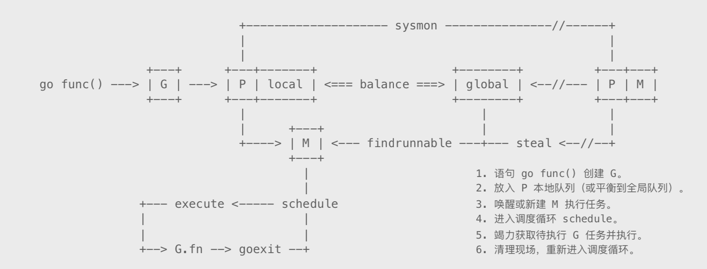

# 并发调度GPM

基本关系示意图:


- Goroutine(G)  
  进程内的一切都在以Goroutine方式运行，包括运行时相关服务，以及main.main入口函数。需要指出，G并非执行体，它仅仅保存并发任务状态，为任务执行提供所需栈内存空间。G任务创建后被放置在P本地队列或者全局队列，等待工作线程调度执行

  进程内的一切以G方式运行，G保存着并发任务状态， 为任务执行提供栈内存空间，被被创建后放在P的本地队列中，等待工作进程调度执行
- Process(P) 
  作用类似CPU内核，用来控制可同时并发执行的任务数量。每个工作线程必须要绑定一个有效的P才被允许执行任务，否则只能休眠，直到有空闲P时被唤醒。P还为线程提供执行资源，比如对象分配内存 本地任务队列等。线程独享所绑定的P资源，可在无锁状态下执行高效操作

  P M必须绑定一个P才可以运行任务，P为线程提供执行资源，无锁操作
- M(Thread)
  实际执行体时系统线程(M),他和P绑定，以调度循环方式不停执行G并发任务。M通过修改寄存器，将执行栈指向G自带内存，并在此空间分配堆栈，执行任务函数。当需要中途切换时，只要将相关寄存器值保存回G空间即可维持状态，任何M都可以据此恢复执行。线程仅负责执行，不再持有状态，这是并发任务跨线程调度，实现多路复用的根本所在

  M实际执行，必须还P绑定后才可以运行任务，运行时从P中取出G然后执行，

P(Process)数量相对恒定，默认与CPU数量相等，M则是调度器按需创建  
当M因陷入`系统调用`而长时间`阻塞`时，P就会被`监控线程抢回`，去`新建`或者`唤醒`一个新的M执行其他任务。

G初始栈仅有`2KB`，且创建操作只是在用户空间`简单的对象分配`，远比进入内核态分配线程要简单的多。  
调度器让`多个M`进入`调度循环`，`不停的获取`并`执行任务`，所以可以创建成千上万个并发任务

在M与P绑定后，M会不断从P的Local队列(runq)中取出G(无锁操作)，切换到G的堆栈并执行，当P的Local队列中没有G时，再从Global队列中返回一个G(有锁操作，因此实际还会从Global队列批量转移一批G到P Local队列)，当Global队列中也没有待运行的G时，然后在网络队列中查询，如果还是没有就会从其它的P窃取(steal)部分G来执行。
如果执行任务发生了阻塞，

## 初始化

`scheduinit`来初始化 
`/usr/local/go/src/runtime/proc.go`

```go
func schedinit(){}
```

`sched.maxmcount = 10000` 设置最大的M数量

`procs := ncpu` 初始化P的数量为CPU核数

如果设置`GOMAXPROCS`则将P的数量设置为此

在调度器初始化阶段，所有P对象都是新建。除分配给当前主线程的外，其他都被放入空闲链表。

在完成调度器初始化后，引导过程才创建并运行main goroutine

```/usr/local/go/src/runtime/asm_amd64.s :193
	CALL	runtime·args(SB)
	CALL	runtime·osinit(SB)
	CALL	runtime·schedinit(SB)

	// create a new goroutine to start program
	MOVQ	$runtime·mainPC(SB), AX		// entry
	PUSHQ	AX
	PUSHQ	$0			// arg size
	CALL	runtime·newproc(SB)
	POPQ	AX
	POPQ	AX
```

`go func(...)`语句将会被翻译为`newproc`调用
`newproc`会为`newproc1`准备好参数 


并发任务单元`G`  
G是一个结构体包含了 执行单元的一些信息
runtime2.go:338
```go
type g struct {
	stack       stack       // 执行栈
    
	sched          gobuf            // 用于保存执行现场
	goid           int64            // 唯一序号
	lockedm        muintptr
	gopc           uintptr         // 调用者PC

	startpc        uintptr         // 任务函数
}

```


`newproc1`创建并发单元G  
`src/runtime/proc.go`
```go
func newproc1(fn *funcval, argp *uint8, narg int32, callergp *g, callerpc uintptr) {
    _g_ := getg()

    // 从当前 P 复用链表获取空闲G对象
    _p_ := _g_.m.p.ptr()
    newg := gfget(_p_)
    
    // 获取失败 新建一个G对象
	if newg == nil {
		newg = malg(_StackMin)
		casgstatus(newg, _Gidle, _Gdead)
		allgadd(newg) // publishes with a g->status of Gdead so GC scanner doesn't look at uninitialized stack.
    }
    // 测试 G对象的栈
    if newg.stack.hi == 0 {
		throw("newproc1: newg missing stack")
    }
    // 测试G对象的状态
    if readgstatus(newg) != _Gdead {
		throw("newproc1: new g is not Gdead")
    }
    // 计算所需空间 并对其
    totalSize := 4*sys.RegSize + uintptr(siz) + sys.MinFrameSize // extra space in case of reads slightly beyond frame
    totalSize += -totalSize & (sys.SpAlign - 1)                  // align to spAlign
    
    // 确定SP和参数入栈位置
    sp := newg.stack.hi - totalSize spArg := sp
    // 将执行参数拷贝入栈
    memmove(unsafe.Pointer(spArg), unsafe.Pointer(argp), uintptr(narg))


    // 初始化用于保存执行现场的区域
    memclrNoHeapPointers(unsafe.Pointer(&newg.sched), unsafe.Sizeof(newg.sched))
	newg.sched.sp = sp
	newg.stktopsp = sp
	newg.sched.pc = funcPC(goexit) + sys.PCQuantum // +PCQuantum so that previous instruction is in same function
	newg.sched.g = guintptr(unsafe.Pointer(newg))
	gostartcallfn(&newg.sched, fn)

    // 初始化基本状态
	newg.gopc = callerpc
	newg.ancestors = saveAncestors(callergp)
	newg.startpc = fn.fn
	if _g_.m.curg != nil {
		newg.labels = _g_.m.curg.labels
	}
	if isSystemGoroutine(newg) {
		atomic.Xadd(&sched.ngsys, +1)
	}
	newg.gcscanvalid = false
	casgstatus(newg, _Gdead, _Grunnable)


    // 设置G对象的唯一ID
    if _p_.goidcache == _p_.goidcacheend {
	// Sched.goidgen is the last allocated id,
	// this batch must be [sched.goidgen+1, sched.goidgen+GoidCacheBatch].
	// At startup sched.goidgen=0, so main goroutine receives goid=1.
	_p_.goidcache = atomic.Xadd64(&sched.goidgen, _GoidCacheBatch)
	_p_.goidcache -= _GoidCacheBatch - 1
	_p_.goidcacheend = _p_.goidcache + _GoidCacheBatch
	}
	newg.goid = int64(_p_.goidcache)
    _p_.goidcache++
    

    //  将G放入待运行队列
    runqput(_p_, newg, true)
```
`runqput`放入的规则
- runqput尝试将g放在本地可运行队列上。
- 如果next为false, runqput将g添加到可运行队列的尾部。
- 如果next为真，runqput将g放入_p_.runnext槽中。
- 如果运行队列已满，runnext将g放到全局队列上。


# 线程
当`newproc1`成功创建完G任务后，会使用`wakep`唤醒M执行任务 
```go
// Tries to add one more P to execute G's.
// Called when a G is made runnable (newproc, ready).
func wakep() {
	// be conservative about spinning threads
	if !atomic.Cas(&sched.nmspinning, 0, 1) {
		return
	}
	startm(nil, true)
}
```

唤醒或者新建M来运行G
```go
func startm(_p_ *p, spinning bool) {
	lock(&sched.lock)
	if _p_ == nil {     // 如果没有指定P 则获取一个空闲的P
		_p_ = pidleget()
		if _p_ == nil { // 获取失败 退出
			unlock(&sched.lock)
			if spinning {
				// The caller incremented nmspinning, but there are no idle Ps,
				// so it's okay to just undo the increment and give up.
				if int32(atomic.Xadd(&sched.nmspinning, -1)) < 0 {
					throw("startm: negative nmspinning")
				}
			}
			return
		}
	}
	mp := mget()        // 获取一个休眠的
	unlock(&sched.lock) 
	if mp == nil {      // 获取失败 新建
		var fn func()   // 
		if spinning {
			// The caller incremented nmspinning, so set m.spinning in the new M.
			fn = mspinning
		}
		newm(fn, _p_)
		return
	}
	if mp.spinning {
		throw("startm: m is spinning")
	}
	if mp.nextp != 0 {
		throw("startm: m has p")
	}
	if spinning && !runqempty(_p_) {
		throw("startm: p has runnable gs")
	}
	// The caller incremented nmspinning, so set m.spinning in the new M.
	mp.spinning = spinning
	mp.nextp.set(_p_)
	notewakeup(&mp.park)        // 唤醒M
}
```
M的结构体
runtime2.go
```go
type m struct {
	g0      *g     // 提供系统栈空间
	mstartfn      func()    //启动函数
	curg          *g       // 当前运行的G
	p             puintptr // 绑定的P
	nextp         puintptr  // 临时存放的P
	
	spinning      bool // 自旋状态
	
	park          note      // 休眠锁
	
	schedlink     muintptr  // 链表
}
```
创建新的M对象  
```go
func newm(fn func(), _p_ *p) {
	mp := allocm(_p_, fn)   // 新建M对象
	mp.nextp.set(_p_)
	mp.sigmask = initSigmask
	if gp := getg(); gp != nil && gp.m != nil && (gp.m.lockedExt != 0 || gp.m.incgo) && GOOS != "plan9" {
		// We're on a locked M or a thread that may have been
		// started by C. The kernel state of this thread may
		// be strange (the user may have locked it for that
		// purpose). We don't want to clone that into another
		// thread. Instead, ask a known-good thread to create
		// the thread for us.
		//
		// This is disabled on Plan 9. See golang.org/issue/22227.
		//
		// TODO: This may be unnecessary on Windows, which
		// doesn't model thread creation off fork.
		lock(&newmHandoff.lock)
		if newmHandoff.haveTemplateThread == 0 {
			throw("on a locked thread with no template thread")
		}
		mp.schedlink = newmHandoff.newm
		newmHandoff.newm.set(mp)
		if newmHandoff.waiting {
			newmHandoff.waiting = false
			notewakeup(&newmHandoff.wake)
		}
		unlock(&newmHandoff.lock)
		return
	}
	newm1(mp)
}

func newm1(mp *m) {
	if iscgo {
		var ts cgothreadstart
		if _cgo_thread_start == nil {
			throw("_cgo_thread_start missing")
		}
		ts.g.set(mp.g0)
		ts.tls = (*uint64)(unsafe.Pointer(&mp.tls[0]))
		ts.fn = unsafe.Pointer(funcPC(mstart))
		if msanenabled {
			msanwrite(unsafe.Pointer(&ts), unsafe.Sizeof(ts))
		}
		execLock.rlock() // Prevent process clone.
		asmcgocall(_cgo_thread_start, unsafe.Pointer(&ts))
		execLock.runlock()
		return
	}
	execLock.rlock() // Prevent process clone.
	newosproc(mp)       // 创建系统线程
	execLock.runlock()
}
```


被唤醒进入工作状态的 M，会陷入调度循环，从各种可能场所获取并执行 G 任务。只有 当彻底找不到可执行任务，或因任务用时过长、系统调用阻塞等原因被剥夺 P 时，才会进 入休眠状态。

大量闲置且不被回收的线程 M对象 g0栈空间都是资源浪费 


# 执行
M执行G有两个起点
- 线程启动函数mstart
- stopm休眠唤醒后再度恢复调度循环

`proc.go:func mstart()`

准备进入工作状态的M必须绑定一个有效P，nextp临时持有待绑定P对象。  
P为M提供cache。以便为执行绪提供对象内存分配  

一切就绪后，M 进入核心调度循环，这是一个由 schedule、execute、goroutine fn、goexit 函数构成的逻辑循环。就算 M 在休眠唤醒后，也只是从 “断点” 恢复。

```go
// Finds a runnable goroutine to execute.
// Tries to steal from other P's, get g from global queue, poll network.
func findrunnable() (gp *g, inheritTime bool) {
```

当G发生系统调用阻塞时，此时G的状态被修改为`_Gsyscall`，这时P的本地队列如果还有G，P就会和当前的M解绑，去重新寻找一个M或者新建，唤醒，但是已经阻塞的G还是在M上，当系统调用完成后，这时G是不会被继续执行的，然后去寻找空闲的P，如果没有寻找到就加入到Global Queue中去。


监控线程sysmon对syscall非常重要，因为他负责将因系统调用长时间阻塞的P抢回，用于执行其他任务

# 监控

- 释放闲置超过5分钟的span物理内存
- 如果超过两分钟没有垃圾回收，强制执行
- 将长时间未处理的netpoll结果添加到任务队列
- 向长时间运行的G任务发出抢占式调度
- 收回因syscall长时间阻塞的P

**抢占式调度**  
因为 Golang 调度器并没有真正意义上的时间片概念，只是在目标 G 上设置一个抢占标志， 当该任务调用某个函数时，被编译器安插的指令就会检查这个标志，从而决定是否暂停当 前任务


