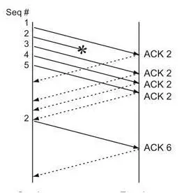

## HTTP 的 Keep-Alive模式
当使用普通模式时，即非`KeepAlive`模式时，每个请求/应答都需要新建一个连接，数据传输完成后立即断开连接；当使用`Keep-Alive`模式时，这个模式时客户端和服务端的连接是在数据传输完成后是不中断的，当后续又有请求时，可以复用连接

如何判断请求所得到的响应数据已经接受完成
- 使用消息首部字段`Conent-Length`  
  表示实体内容长度，客户端可以根据这个值来判断数据是否接受完成
- 使用消息首部字段`Transfer-Encoding`  
  在传输一些动态页面时，服务器是与现实不知道内容大小，这时就可以使用`Transfer-Encoding: chunk`模式来传输数据。即如果要一边生产数据，一边发送数据给请求端，就要使用`Transfer-Encoding:chunked`这样的方式来代替`Conteng-Length`。chunk编码将数据分为一块一块的发生。Chunked编码将使用若干个Chunk串连而成，由一个标明长度为0的chunk标识结束。

## TCP保证有序
主机每次发送数据时，TCP就给每个数据包分配一个序列号并且在特定的时间内等待接收主机对分配的序列号进行确认，如果发送主机在特定的时间内没有收到接收主机的确认，则发送主机将会重传此数据包，。接收主机利用序列号对接收的数据进行确认，以便检测对方发送的数据是否有丢失或者乱序等，接收主机一旦接收已经顺序化的数据，他就将这些数据按照正确的顺序进行重组成数据流并流向高层处理

## 快速重传机制
当接受端收到接收到比期望序号大的报文段时，便会重新发送最近一次确认的报文段的确定信号，当在超时重传定时器溢出之前，接收到三个重复的冗余ACK，发送端就会知道在哪个报文段传输过程中丢失了，于是重发该报文段

大多数的快速重传都会在大于3次冗余ACK后发生。

## 超时重传
超时重传是TCP协议保证数据可靠性的另一个重要机制，其原理是在发送某一个数据以后就开启一个计时器，在一定时间内如果没有得到发送的数据报的ACK报文，那么就重新发送数据，直到发送成功为止。

## 拥塞控制
TCP的拥塞控制是从端对端的角度，推测网络是否发生拥塞，如果网络发生拥塞则立即将数据发送速率降下来，来缓解网络拥塞

采用窗口机制，通过调节窗口大小来实现对数据发送速率的调整。

发送端判断网络发生拥塞的依据时：发送端设置一个重传计时器，对于某个发送出得数据报文段，如果在计时到期后，还没有收到来自接收端的确认，则认为此时网络发生了拥塞

TCP的拥塞控制算法包括慢启动，拥塞避免，快速重传，快速恢复

拥塞窗口 快速增加 慢启动算法

慢启动阀值 拥塞窗口到达这个值后，启动拥塞避免算法，减缓增加的速度

发送端没有收到接收端的确认时，就发生了阻塞，将慢启动阀值设置为发生超时时拥塞窗口的一般，拥塞窗口设置为1，

当拥塞窗口大于等于慢启动阈值时，启动拥塞避免算法

快速恢复是配合快速重传的算法

当发送端接收到三个相同的ACK时，就将慢启动阀值减半，以防网络拥塞发生，然后将拥塞窗口修改为减半后的慢启动阀值，然后执行拥塞避免算法将拥塞窗口阀值加+1
