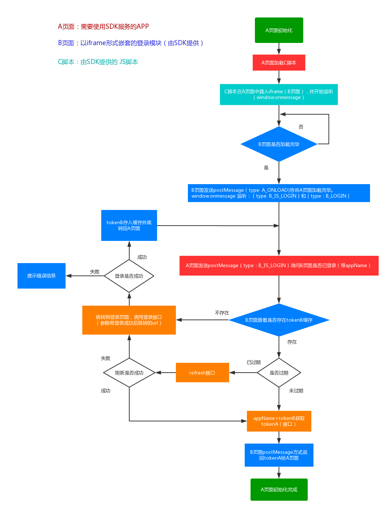

## 写出下面代码输出的内容
```go
package main

import (
    "fmt"
)

func main() {
    defer_call()
}

func defer_call() {
    defer func() { fmt.Println("打印前") }()
    defer func() { fmt.Println("打印中") }()
    defer func() { fmt.Println("打印后") }()

    panic("触发异常")
}
```

考点：defer执行顺序

defer是先进后出，panic需要等待defer结束后才会向上传递，出现panic的时候，会按照defer的后入先出的顺序执行，最后才执行panic，
```
打印后
打印中
打印前
panic: 触发异常
```

## 以下代码有什么问题，说明原因。
```go
type student struct {
    Name string
    Age  int
}

func main() {
    m := make(map[string]*student)
    stus := []student{
        {Name: "zhou", Age: 24},
        {Name: "li", Age: 23},
        {Name: "wang", Age: 22},
    }
    for _, stu := range stus {
        m[stu.Name] = &stu
    }

}
```
最终m的value将指向最后一个循环的值，range直接是使用副本的方式，所以stu实际上指向同一个指针，最终该值为遍历的最后一个struct的拷贝

## 下面的代码会输出什么，并说明原因
```go
func main() {
    runtime.GOMAXPROCS(1)
    wg := sync.WaitGroup{}
    wg.Add(20)
    for i := 0; i < 10; i++ {
        go func() {
            fmt.Println("A: ", i)
            wg.Done()
        }()
    }
    for i := 0; i < 10; i++ {
        go func(i int) {
            fmt.Println("B: ", i)
            wg.Done()
        }(i)
    }
    wg.Wait()
}
```
随机数字，但是A后面都是10，第一个i的地址是不变化的所有i的值取决于遍历最后一个的值也就是10
B0-9顺序是不定的，因为将每次的值已经拷贝到了go func中去

## 下面代码会输出什么？
```go
type People struct{}

func (p *People) ShowA() {
    fmt.Println("showA")
    p.ShowB()
}
func (p *People) ShowB() {
    fmt.Println("showB")
}

type Teacher struct {
    People
}

func (t *Teacher) ShowB() {
    fmt.Println("teacher showB")
}

func main() {
    t := Teacher{}
    t.ShowA()
}
```
输出  
showA
showB


## 下面代码会触发异常吗？请详细说明
```go
func main() {
    runtime.GOMAXPROCS(1)
    int_chan := make(chan int, 1)
    string_chan := make(chan string, 1)
    int_chan <- 1
    string_chan <- "hello"
    select {
    case value := <-int_chan:
        fmt.Println(value)
    case value := <-string_chan:
        panic(value)
    }
}
```
可能触发异常也有可能不触发异常，chan是有缓冲的，如果多个case都可以return则随机抽取一个运行

## 请写出以下输入内容
```
func main() {
    s := make([]int, 5)
    s = append(s, 1, 2, 3)
    fmt.Println(s)
}
```
[0,0,0,0,0,1,2,3]

## 下面的代码有什么问题?
```go
type UserAges struct {
	ages map[string]int
	sync.Mutex
}

func (ua *UserAges) Add(name string, age int) {
	ua.Lock()
	defer ua.Unlock()
	ua.ages[name] = age
}

func (ua *UserAges) Get(name string) int {
	if age, ok := ua.ages[name]; ok {
		return age
	}
	return -1
}
```
可能会出现fatal error: concurrent map read and map write.  因为map不是线程安全的，写的时候不允许read 需要给read加读锁

## 是否可以编译通过？如果通过，输出什么？
```go
func main() {
	i := GetValue()

	switch i.(type) {
	case int:
		println("int")
	case string:
		println("string")
	case interface{}:
		println("interface")
	default:
		println("unknown")
	}

}

func GetValue() int {
	return 1
}
```
编译不通过，type只可以用于接口


## 是否可以编译通过？如果通过，输出什么？
```go
func main() {
	list := new([]int)
	list = append(list, 1)
	fmt.Println(list)
}
```
不行，new返回的是指向类型T的指针


## 是否可以编译通过？如果通过，输出什么？
```go
func Foo(x interface{}) {
	if x == nil {
		fmt.Println("empty interface")
		return
	}
	fmt.Println("non-empty interface")
}
func main() {
	var x *int = nil
	Foo(x)
}
```

non-empty interface 

接口值为nil但是接口类型不为nil，一个接口为nil必须接口值和接口类型同时为nil

## 是否可以编译通过？如果通过，输出什么？
```go

func GetValue(m map[int]string, id int) (string, bool) {
	if _, exist := m[id]; exist {
		return "存在数据", true
	}
	return nil, false
}
func main()  {
	intmap:=map[int]string{
		1:"a",
		2:"bb",
		3:"ccc",
	}

	v,err:=GetValue(intmap,3)
	fmt.Println(v,err)
}
```
nil不可以用作string

nil 可以用作 interface、function、pointer、map、slice 和 channel 的“空值”。


## 下面函数有什么问题？
```go
package main
const cl  = 100

var bl    = 123

func main()  {
    println(&bl,bl)
    println(&cl,cl)
}
```

常量不同于变量的在运行期分配内存，常量通常会被编译器在预处理阶段直接展开，作为指令数据使用，

cannot take the address of cl

## 编译执行下面代码会出现什么?
```go
package main

func main()  {

    for i:=0;i<10 ;i++  {
    loop:
        println(i)
    }
    goto loop
}

```
goto 不可以跳转到循环内部

## 编译执行下面代码会出现什么?
```go
package main
import "fmt"

func main()  {
    type MyInt1 int
    type MyInt2 = int
    var i int =9
    var i1 MyInt1 = i
    var i2 MyInt2 = i
    fmt.Println(i1,i2)
}
```
基于一个类型创建一个类型叫做defintion；基于一个类型创建一个别名叫做alias，MyInt1为defintion,虽然底层类型为int但是不可以直接赋值，MyInt2称之为alias，可以直接赋值
cannot use i (type int) as type MyInt1 in assignment

## 编译执行下面代码会出现什么?
```go
package main
import "fmt"

type User struct {
}
type MyUser1 User  // 创建一个类型
type MyUser2 = User  // 定义一个别名
func (i MyUser1) m1(){
    fmt.Println("MyUser1.m1")
}
func (i User) m2(){
    fmt.Println("User.m2")
}

func main() {
    var i1 MyUser1
    var i2 MyUser2
    i1.m1()
    i2.m2()
}
```
别名拥有所有方法，新创建的类型必须定义自已的方法

## 编译执行下面代码会出现什么?
```go
package main

import "fmt"

type T1 struct {
}
func (t T1) m1(){
    fmt.Println("T1.m1")
}
type T2 = T1
type MyStruct struct {
    T1
    T2
}
func main() {
    my:=MyStruct{}
    my.m1()
}
```
结果不限于方法，字段也也一样；也不限于type alias，type defintion也是一样的，只要有重复的方法、字段，就会有这种提示，因为不知道该选择哪个。

## 编译执行下面代码会出现什么?
```go
func main()  {
    defer func() {
        if err:=recover();err!=nil{
            fmt.Println("++++")
            f:=err.(func()string)
            fmt.Println(err,f(),reflect.TypeOf(err).Kind().String())
        }else {
            fmt.Println("fatal")
        }
    }()

    defer func() {
        panic(func() string {
            return  "defer panic"
        })
    }()
    panic("panic")
}
```
考点：panic仅有最后一个可以被revover捕获
输出   
++++
0x1091800 defer panic func


# go结构体可以比较吗
只有同一类型的可以比较
# select可以用来干什么
- 超时检测
- goroutinue退出
- 从多个返回channel取最快的一个
- 随机选择

# context包的用途
- 通常被译为上下文，可以用来在多个处理函数传递数据， 还可以控制一些超时时间等，控制函数

# 主协程如何等待其余协程完成在操作
- channel
- context
- sync.WaitGroup
# slice扩容
append函数，因为slice底层的数据结构是数组、len、cap组成，所在添加新的元素时，会检查是否容量是否超出，如果容量超出，就会扩容

# map如何顺序读取
map不能顺序，因为是无序的，想要有序读取，就必须将key变为有序，然后遍历key通过key取值

# 实现set
```go
type inter interface{}
type Set struct {
    m map[inter]bool
    sync.RWMutex
}
type New() *Set {
    return &Set{
        m: map[inter]bool{},
    }
}
func (s *Set)Add(iten inter) {
    s.Lock()
    defer s.Unlock()
    s.m[item] = true
}
```

# 实现消息队列
使用channel

# 大文件排序
将大文件分为多个小文件，然后排序后，使用归并排序再将多个已经排好序的小文件合并

# keep-alive
Keep-Alive是一个通用的消息头，允许消息发送者暗示连接的状态，还可以用来设置超时时间

# http能不能依次连接多次请求，不等后端返回
http本质上是使用socket连接，因此发送数据请求，接写入tcp缓冲，是可以多次进行的，这也是http无状态的原因

# tcp与udp的区别
TCP是面向连接的，安全的，可靠的连接，面向字节流，全双工的可靠信道
UDP是不可靠的，不安全的不可靠的连接，面向报文，不可考新到

# TIME-WAIT状态的作用
主动关闭的Socket端会进入TIME-WAIT状态，并且持续2MSL时间长度，MSL就是最大分解生命期，这个是一个数据包在互联网上生存的最长时间，超过这个时间将在网络上消失，

存在的理由  
- 可靠的实现TCP全双工连接的终止
  在进行关闭连接思路握手协议时，最后的ACK是由主动关闭端发出的，如果这个ACK丢失，服务器将重发最终的FIN，所以主动关闭方必须等待，2MSL后才关闭。
- 在第四次挥手后，经过2MSL的时间足以让本次连接产生的所有报文段从网络中消息，这样下一次连接就不会产生旧的连接报文了

# 死锁
## 必要条件
- 互斥  
  一个资源只能被一个进程使用  
- 请求与保持  
  一个进程因请求资源而阻塞时，对已获得的资源保持不放
- 不剥夺    
  进程已获得的资源，在未使用完之前，不能强行剥夺  
- 循环等待  
  若干进程之间形成一种头尾相连接的循环等待资源关系

# 孤儿进程与僵尸进程
- 孤儿进程 一个父进程退出，而它的一个或多个子进程还在运行，那么那么子进程将成为孤儿进程。孤儿进程会被init进程所回收
- 僵尸进程 一个进程使用fork创建子进程，如果子进程退出，而父进程并没有调用wait或者waitpid获取子进程的状态信息，那么子进程的进程描述符仍然保存在系统中。使用top或者ps可以查看  
  如果产生大量的姜丝进程，将因为没有可用的进程号而导致系统不能产生新的进程，

# mysql索引有哪些 时间复杂度
数据结构
- B+索引O(log(n))
- hash索引O(1)  
- FULLTEXT 索引
物理存储
- 聚簇索引
- 非聚簇索引
逻辑角度
- 主键索引
- 普通索引
- 联合索引
- 唯一索引 非唯一索引
- 空间索引
InnoDb实现的是行锁，写表的时候只影响写的那一行，提高写入的效率


# 生产消费者
```go
func Producer(out chan <-int) {
    for i:=0;i <10 ;i++ {
        out <- i
    }
}

func Consumer(in <-chan int) {
    for v := range in {
        fmt.Println(v)
    }
}

func main() {
    ch := make(chan int,10)
    go Producer(ch)
    go Consumer(ch)
    time.Sleep(5*time)
}
```
# 主键索引与唯一索引
主键一个定创建一个唯一索引，但是有唯一索引的列不一定是主键  
主键不允许空值的，唯一索引列允许空值  
一个表只能有一个主键，但是可以有多个唯一索引   

主键索引是在主键上建的索引 并且只可以有一个
唯一索引可以有多个

# 单点登录
基于cookie的单点登录，一般服务其在用户登录之后，会将JWT字符串作为登录请求Cookie的一部分返回给用户，这样在Cookie失效或者删除之前，用户每次访问，都会验证Cookie有效性，
```
Set-Cookie: jwt=lll.zzz.xxx; HttpOnly; max-age=980000; domain=.mycompany.com
```


# 索引越多越好吗
- 数据小的表不需要建立索引
- 不经常使用的列不要建立索引
# 进程线程协程区别
- 进程  
  进程是系统进行资源分配和调度的一个独立单位。每个进程都有自已的独立内存空间，不同进程通过进程间通信通信  
  由于进程比较中昂，占据独立的内存，所以上下文切换开销比较大，但是比较安全
- 线程  
  线程是进程的一个实体，是CPU调度和分配的基本单位，它是比进程更小的独立运行的基本单位。  进程与属于同一进程的其他线程锁拥有全部的资源 线程间通信主要通过共享内存，上下文切换很快，资源开销较小，但是不是很安全，一个进程崩溃会影响到其他进程
- 协程  
  协程是一种用户态的轻量级线程，协程的调度完全有用户控制，协程拥有自己的寄存器上下文和栈。协程调度切换时，将寄存器上下文和栈保存到其他地方，在切回来的时候，恢复先前保存的寄存器上下文和栈，直接操作栈则基本没有内核切换的开销，可以不加锁的访问全局变量，所以上下文的切换非常快。


进线程区别
- 地址空间
- 资源拥有
- 线程是处理器调度的基本单位，
- 二者可并发执行
- 线程必须依赖与进程
  