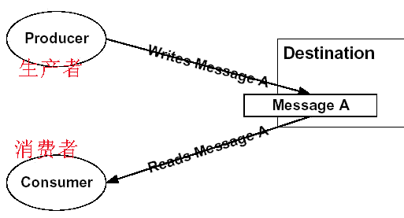

# 事件驱动架构

简称EDA(Event Driven Architecture)

事件代表过去发生的事情，事件即使技术架构概念，也是业务概念。以事件为驱动的编程模型称为事件驱动架构EDA。

EDA是一种以事件为媒介，实现组建或服务之间最大松耦合的方式。传统面向接口编程是以接口为媒介，实现调用接口者和接口实现者之间的解藕，但是这种程度不是很高，如果接口发生变化，双方代码都需要改动，而事件驱动则是调用者和被调用互相不知道对方，两者只和中间消息队列耦合。

事件驱动架构的图示

事件驱动有以下特征
- 生产者producer发生实事事件
- 推送通知
- 生产者发射机完成 fire - and - orget
- 消费者consumer立即响应
- 事件与命令是有区别的

如果一个系统想知道交易系统的状态，他不是发送一个消息给交易系统，拉取它当前的状态而是向事件总线订阅，当交易系统有状态报告时，将发出事件通知报表系统。